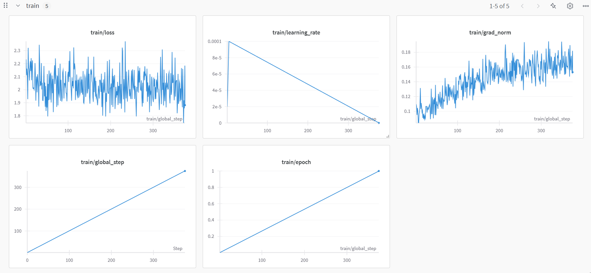

# Just Done Test Case (Text Style Transfer Model)

I fine-tuned Qwen 2.5 (7B) and got 2 models:
* On the entire dataset for 1 epoch (3000 samples)
* I splitted the dataset into train (2400 samples) and validation (600 samples). And fine-tuned on 20 steps (80 training samples) and evaluated on validation dataset.

I logged losses into wandb project and saved the models into huggingface models
* https://huggingface.co/melnnnnn/just-done-v1 (trained for 1 epoch (8 hours) on the entire dataset)
* https://huggingface.co/melnnnnn/just-done-v5 (trained for 80 training samples (3 hours))

**Why Qwen 2.5 (7B)?**

I used Kaggle for training that possessed 16GB P100 GPU. So I need the model to fit into 16GB + memory for training.

For alternatives I considered LLaMa 3.1 (8b) and Ministral (8b)

Since we need give the most human-like responses I searched the web for this benchmark but it does not exist yet.

That's why I rely on MMLU-Pro benchmark which designed to evaluate language understanding models across broader and more challenging tasks

But since here MMLU-Pro of Ministral (8b) is not calculated I visited https://huggingface.co/spaces/TIGER-Lab/MMLU-Pro website and found MMLU-Pro for Ministral 7b which equals 37.93% that is less than Qwen 2.5 (7b) 56.3% and LLaMa 3.1 (8b) 48.3%

We can see comparison between these 2 models and can conclude that Qwen 2.5 (7B) is much better choice for fine-tuning

Now we can finally conclude that Qwen 2.5 (7B) is more suitable for fine-tuning than Ministral (8b) and LLaMa 3.1 (8b)

**Why Unsloth?**

Based on Unsloth documentation Qwen 2.5 (7B) performance with Unsloth improves by 2x and uses less 70% less

## Project structure

* images/ (contains all the needed images of README.md)
* src/ (source code of my project)
  * finetuning/ (contains fine-tuning scripts in Python script format)
    * `train.py` (fine-tuning script in Python script format)
  * gradio_chat/ (contains Python script for building Gradio chat that uses my fine-tuned model)
    * `main.py` (Python script for building Gradio chat that uses my fine-tuned model)
  * notebooks/ (contains notebooks for finetuning and EDA)
    * `llm-finetuning-20-steps.ipynb` (contains ipynb notebook of Qwen2.5 (7b) fine-tuning for 20 steps)
    * `llm-finetuning-1-epoch.ipynb` ((contains ipynb notebook of Qwen2.5 (7b) fine-tuning for 1 epoch))
    * `eda-of-just-done-dataset.ipynb` (contains EDA of the dataset)

## Results of EDA

* There is always a blank line between paragraphs in LLM-generated text and this text
* LLM-generated is much more readable but also obviously artificial
* Because there are only 12.2% of rows that equal or greater than 2048 we can choose `max_seq_length` of 2048
* The most frequent words in human texts are: said, will, one
* The most frequent words in LLM-generated texts are: new, one, s

## Results of finetuning

### First model (1 epoch)

I trained the first model and logged info into wandb project https://wandb.ai/apsoidal-/just-done-v3/runs/a5epdc3k

I set these hyperparameters for fine-tuning:

* learning rate of $10^-4$
* per_device_train_batch_size=2
* gradient_accumulation_steps=4 (2*4 = 8, so my batch size is 8 samples)
* warmup_steps = 5
* optim="adamw_8bit"
* lr_scheduler_type="linear"

For instruction prompt I defined: 

`"Rewrite the given AI-generated text to make it sound more human-like, improving fluency, coherence, and naturalness while preserving the original meaning."`

The training loss almost didn't reduce. It could happen because of high learning rate of $10^-4$ that's why in the second I reduce it to $5 * 10^-5$. And because here I didn't evaluate on the validation dataset I cannot correctly judge about the performance of the model

### Second model (20 steps)

I trained the second model and logged info into wandb project I trained the first model and logged info into wandb project https://wandb.ai/apsoidal-/just-done-v3/runs/a5epdc3k

I set these hyperparameters for fine-tuning:

* learning rate of $5 * 10^-5$
* per_device_train_batch_size=2
* gradient_accumulation_steps=4 (2*4 = 8, so my batch size is 8 samples)
* optim="paged_adamw_32bit",

In the previous model I used `adamw_8bit` but 8bit is too small for gradients that's why here I used 32bit for gradients. And because of high learning rate the training loss coudn't converge I reduce it to $5 * 10^-5$ 

For instruction prompt I defined: 

`"Rewrite the given AI-generated text to make it sound more human-like, improving fluency, coherence, and naturalness while preserving the original meaning."`

Wandb training logs for second model:

In the first steps training loss reduced but after these steps there is a spike at 16-th step. This is because of small number of training samples (80 samples) and the training loss for this small amount of small didn't finish to converge. Let's check the validation logs

Wandb validation logs for second model:

Here we can see a better situation - the validation slowly reduced

## Q&A

### Part 1

- How can the chosen NLP model architecture and training process be adjusted to minimize the probability of hallucinations? Describe the integration of the updated architecture and parameters into the existing model training functionality.

To mitigate the probability of hallucinations we can use these methods:
* Prompt engineering
* Few-shot learning
* Fine-tuning on domain-specific dataset
* Reinforcement Learning from Human Feedback (RLHF)
  * RLHF can help mitigate hallucination with human feedback. By collecting data where humans rank different model-generated responses based on their quality, the model can learn to adjust its outputs to better align with human expectations.
* Retrieval Augmented Generation (RAG)
  * Using augmentation we provide additional information that is passed to the LLM
* Chain of Verification
  * CoVe generates a few verification questions to ask, and then executes these questions to check for agreement
* Chain of thought

What about integration of the updated architecture and parameters into the existing model training functionality.

I would choose RAG architecture to reduce hallucinations. To implement this architecture I would collect dataset, then compute embeddings and store in Vector DB (FAISS / Pinecone).

Example of pipeline:

1. User asks a question 
2. Retrieve $n$ appropriate passages (Assymetrical Semantic Search) using Hybrid retriever (Dense retriever + BM25 retriever)
3. Using (cross-encoder) reranker model I would choose out of $n$ passages $k$ most correct passages. Where $n > k$
4. Augment prompt using the retrieved and reranked passages and give response to the user

- How will you set up the system to monitor and track the occurrence of hallucinations? Describe the main mechanism, components, and the way of integration.

The main part of this system is to detect hallucination (for example using SelfCheckGPT NLI)

Pipeline:

0. Computing embeddings for documents
1. User asks a question
2. AI agent search for an answer in Vector DB
3. We get response from Vector DB and give response based on augmented prompt
4. Call hallucination detector (for example SelfCheckGPT NLI) whether there is a hallucination
5. If there is hallucination we wait for the Customer Service Agent to answer the question
6. If there is not hallucination - we return answer from AI agent to our user

### Part 2

Assume you have completed the training using the provided code and monitored the process. Using the plot as a reference, brainstorm and answer the following questions.

- Which problems with the training can you highlight according to the presented losses?
  - I can highlight that we have overfitting  problem because training reduced while validation loss stagnating (increased from 2 to 2.1).
- What can be changed in the training process to tackle highlighted issues?
  - Collect more high-quality data, ensure consistent preprocessing for train/val data, add regularization
- How can you explain the unexpected fluctuation in the training loss around epoch 50?
  - This is due to gradient explosion (we need to clip the gradient to tackle the issue, reduce learning rate and increase batch size)
- How can you explain the different ranges of the training/validation losses?
  - This is possibly due to or a mismatch in data distribution. In other words training and validation data comes from different distributions
- How can we minimize the probability of the presented situation from the very beginning?
  - Split dataset properly into 2 dataset that comes from the same distribution
  - Use gradient clipping to reduce gradient explosion problem
  - Use smaller learning rate